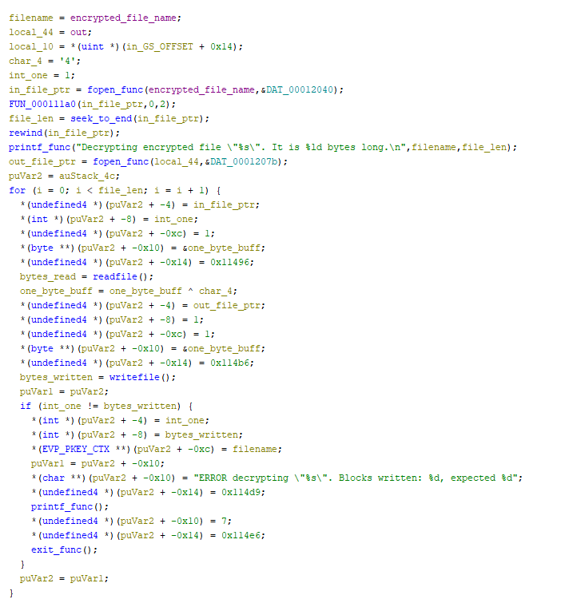
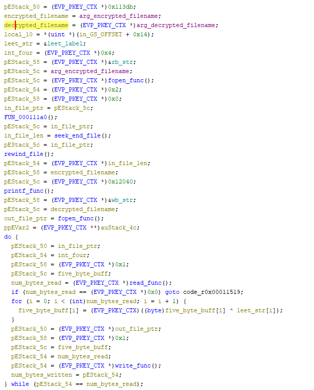

# Assignment 5


## Ransomware 1

### Decryption Program
```python
import sys

def decrypt_file(filename):
    decrypted_file = bytes()

    with open (filename, "rb") as f:
        data = f.read()

        for byte in data:
            new_byte = (byte ^ 0x34).to_bytes()
            decrypted_file += new_byte

    with open(filename, "wb") as f:
        f.write(decrypted_file)

if len(sys.argv) != 2:
    print("ERROR: Must pass filename.")
    sys.exit(1)

decrypt_file(sys.argv[1])
```
This function works by reading in each byte from the encrypted file, and then XORing that byte with the character `'4'` (or `0x34`). The program then rewrites the original file with the new decrypted content.


### Decrypted `secret.txt`
```
Dear Student,

You have decrypted the message. Good job!

"Many of the engineers I interviewed worked on reverse-engineering technology. It’s a hallmark of Area 51."
 ~ ANNIE JACOBSEN

Go NMSU RE!
```

### Ghidra Decrypt Function


## Ransomware 2

### Decryption Program
```python
mport sys

# Key:
#  '1' = 49
#  '3' = 51
#  '3' = 51
#  '7' = 55
def decrypt_file(filename):
    with open(filename, "rb") as rw2_file:
        rw2_secret = rw2_file.read()

    decrypted_file = bytes()
    j = 1
    for i in range(len(rw2_secret)):
        if j == 1:
            new_byte = rw2_secret[i] ^ 49

        if j == 2:
            new_byte = rw2_secret[i] ^ 51

        if j == 3:
            new_byte = rw2_secret[i] ^ 51

        if j == 4:
            new_byte = rw2_secret[i] ^ 55
            j = 0

        decrypted_file += new_byte.to_bytes()
        j += 1

    with open(filename, "wb") as f:
        f.write(decrypted_file)

if len(sys.argv) != 2:
    print("ERROR: Must pass filename.")
    sys.exit(1)

decrypt_file(sys.argv[1])
```
This function works by going through the ciphertext byte by byte and XORing each byte with one of three unique numbers (based on characters) based on the position of the byte in the file. The key for this decryption is `1337`, or in decimal, `49 51 51 55`. This means that to decrypt the file, XOR the first byte by `49`, the next second and third by `51` and the fourth by `55`. Then repeat this process of XORing until the end of the file. Essentially, in each group of 4 bytes seen in sequential order, XOR based on the position of that byte in that group (1-4).


### Decrypted `secret.txt`
```
Dear Student,

You have decrypted the message. Good job!

"Basically, if reverse engineering is banned, then a lot of the open source community is doomed to fail."
 ~ Jon Lech Johansen

Go NMSU RE!
```

### Ghidra Decrypt Function



## Ransomware 3

### Decryption Program
```python
import sys
""" 
Key: 
 82  -> j = 1
 51  -> j = 2
 86  -> j = 3
 51  -> j = 4
 82  -> j = 5
 53  -> j = 6
 51  -> j = 7
"""
def decrypt_file(filename):

    with open(filename, "rb") as rw3_file:
        rw3_secret = rw3_file.read()

    decrypted_file = bytes()
    j = 1
    for i in range(len(rw3_secret)):
        if j == 1 or j == 5:
            new_byte = rw3_secret[i] ^ 82

        if j == 2 or j == 4:
            new_byte = rw3_secret[i] ^ 51

        if j == 3:
            new_byte = rw3_secret[i] ^ 86

        if j == 6:
            new_byte = rw3_secret[i] ^ 53

        if j == 7:
            new_byte = rw3_secret[i] ^ 51
            j = 0

        decrypted_file += new_byte.to_bytes()

        j += 1

    with open(filename, "wb") as f:
        f.write(decrypted_file)

if len(sys.argv) != 2:
    print("ERROR: Must pass filename.")
    sys.exit(1)

decrypt_file(sys.argv[1])
```


I found the key to this ransomware by using, I believe, the clever method mentioned in the assignment. I noticed that all the secrets.txt.pay_up files were 204/205 bytes in length, so I made and educated guess that their plaintexts were similar, if not exactly the same. Based off the method of encryption in ransomware1, namely, XORing, I figured the other ransomwares used the same XORing with a key to decrypt the text.

The XOR operation is reversible thus the following is true: `A ⊕ B = C` and `A ⊕ C = B`. 

If we rearrange this for our situation: `Plaintext ⊕ Key = Ciphertext` and `Plaintext ⊕ Ciphertext = Key`. With this principle in mind, I decided to try XORing byte by byte the `secret.txt` from `ransomware1` and `secret.txt.pay_up` from `ransomware3`. 

This is the program I used to do this:
```python
filename1 = "rw1-secret.txt"
filename2 = "secret.txt.pay_up.orig"
with open(filename1, "rb") as rw1_file:
    rw1_secret = rw1_file.read()
with open(filename2, "rb") as rw3_file:
    rw3_secret = rw3_file.read()
keys = []
for i in range(204):
    key = rw1_secret[i] ^ rw3_secret[i]
    keys.append(key)
print(keys)
```
And this program printed out the following array, where each item is the "key" for the byte in that position. For example, to get the first byte of the plaintext for `secret.txt.pay_up`, you must XOR the first byte of the ciphertext with `82`, the second byte with `51`, etc.
```
[82, 51, 86, 51, 82, 53, 51, 82, 51, 86, 51, 82, 53, 51, 82, 51, 86, 51, 82, 53, 51, 82, 51, 86, 51, 82, 53, 51, 82, 51, 86, 51, 82, 53, 51, 82, 51, 86, 51, 82, 53, 51, 82, 51, 86, 51, 82, 53, 51, 82, 51, 86, 51, 82, 53, 51, 82, 51, 86, 51, 82, 53, 51, 94, 114, 95, 37, 29, 62, 117, 23, 41, 89, 63, 28, 53, 56, 71, 122, 76, 62, 94, 41, 43, 1, 90, 31, 52, 28, 51, 51, 86, 32, 77, 37, 64, 112, 54, 28, 32, 25, 32, 74, 59, 36, 82, 52, 81, 126, 83, 53, 41, 81, 97, 68, 52, 16, 37, 41, 21, 46, 80, 51, 23, 52, 46, 69, 56, 31, 52, 67, 63, 56, 28, 63, 85, 50, 70, 41, 108, 7, 31, 76, 178, 183, 223, 96, 29, 52, 86, 47, 91, 60, 127, 92, 61, 73, 40, 29, 52, 48, 28, 6, 87, 118, 82, 123, 98, 67, 110, 13, 77, 44, 112, 32, 1, 82, 112, 24, 59, 0, 97, 119, 2, 122, 15, 117, 21, 88, 62, 51, 86, 30, 38, 82, 20, 23, 17, 118, 21, 115, 53, 43, 118]
```
I immediately noticed that there was a pattern in the first bytes of the key array, namely, `82 51 86 51 82 53 51` repeated for the beginning of the file. I made an educated guess based on how consistently this pattern was repeated (for the first quarter of the file) that this is my key. I implemented the decryption (seen at the top of this section) and came up with readible plaintext, thereby verifying my key was correct.


### Decrypted `secret.txt`
```
Dear Student,

You have decrypted the message. Good job!

"A good engineer thinks in reverse and asks himself about the stylistic consequences of the components and systems he proposes."
 ~ Helmut Jahn

Go NMSU RE!
```