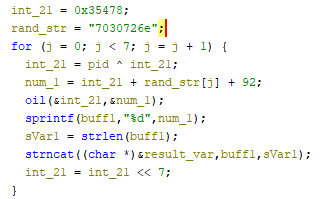

# Assignment 6

## Crackme 1 Solution ([Crackme 1 Download](https://crackmes.dreamhosters.com/users/seveb/crackme05/download/crackme05.tar.gz)):
To solve this crackme, you need to disassemble the `crackme05` linux executable file in order to pull out the serial number constraints. With this contraints you can pass a valid serial number as an argument to the program which solves it.

A solution is `0VW0-C..B-B..C-0WX0`. Here is my program to generate any valid serial number:
```python
valid_chars = string.ascii_letters + "0123456789"
key = [random.choice(valid_chars) for i in range(19)]

# Paper
key[8] = key[10]
key[5] = key[13]
key[0] = '0'
key[3] = '0'
key[15] = '0'
key[18] = '0'

# Scissors
key[1] = random.choice("VWXYZ")
key[2] = random.choice("VWXYZ")
key[16] = random.choice("VWXYZ")

tmp = random.choice("VWXYZ")
while ord(key[1]) + ord(key[2]) == (ord(key[16]) + ord(tmp)):
    tmp = random.choice("VWXYZ")
key[17] = tmp

# Cracker
key[4] = "-"
key[9] = "-"
key[14] = "-"

print(''.join(key), end='')
```

### How I did it using Ghidra:
1. I opened the crackme in Ghidra
2. I opened the `main` function and noticed 5 important function calls: `rock`, `paper`, `scissors`, `cracker`, and `decraycray`. Within all these functions there is another function called `bomb`, which seems to be an error-out function -- so in all the functions I avoid the conditions where `bomb` is called. Also, in all the following explanations, the constraints are made clear by if-else conditions found in the code of the crackme.
3. The function `rock` adds the following constraints to the inputted serial:
  - All characters are >= `'-'`
  - No characters are between `'-'` and `'0'`
  - All characters are either `0-9`, `A-Z`, or `a-z`
  - The input is 19 characters.
4. The function `paper` adds the following constraints to the input:
  - `0 <= (input[8] ^ input[10]) < 10`
  - `0 <= (input[5] ^ input[13]) < 10`
  - `input[3]` and `input[15]` must be equal to `(input[10] ^ input[8]) + 48`
  - `input[0]` and `input[18]` must be equal to `(input[13] ^ input[5]) + 48`
  - **NOTE**: For simplicity, we can require that `input[8]` and `input[10]` are the same, likewise `input[5]` and `input[13]` be the same, which requires `input[3]`, `input[15]`, `input[0]`, and `input[18]` to all be `'0'`.

5. The function `scissors` adds the following constraints to the input:
  - `input[1] + input[2] > 171`
  - `input[16] + input[17] > 171`
  - `(input[1] + input[2]) != (input[16] + input[17])`
  - **NOTE**: This is essentially saying that `input[1]` and `input[2]` must be `V-Z` and likewise `input[16]` and `input[17]` must be `V-Z`, but between the two pairs, they can't both add up to the same number.

6. The function `cracker` adds the following constraints to the input:
  - `(input[4] + input[9] + input[14]) = 135`
  - **NOTE**: The only way this is satisfied (when considering the previous rules) is for all three characters to be `-`

7. A working serial with the constraints (where `.` is any character): `0VW0-C..B-B..C-0WX0`

8. Finally, the `decraycray` function prints out the success message.


## Crackme 2 Solution ([Crackme 2 Download](https://crackmes.dreamhosters.com/users/adamziaja/crackme1/download/crackme1.tar.gz)):
To solve this crackme, you need to input a valid username and serial (or password) pair when the given `crackme1` program is run. When a valid pair is entered, you will receive a success message. In order to determine a valid username/password pair you must disassemble the program (with Ghidra) and determine how the program manipulates the entered username to create a valid password. The manipulation and explanation of it can be found below.

My solution is the following C++ program. This program will randomly generate a username and password pair that is valid for the crackme and print them out. 

One such valid password/serial pair is: `6Dv1wUkEq4`/`11849119`
```C++
#include <iostream>
#include <string>
#include <cstdlib>
#include <ctime>

using namespace std;

// Random String Function Source: https://cplusplus.com/forum/windows/88843/
string randomString(int length){
	char alphanum[] ="0123456789ABCDEFGHIJKLMNOPQRSTUVWXYZabcdefghijklmnopqrstuvwxyz";
	int strLen = sizeof(alphanum) - 1;
	srand(time(NULL));
	string result = "";
	for (int i = 0; i < length; i++)
		result += alphanum[rand() % strLen];
	return result;
}

int main() {

	string username = randomString(10); 
	int usernamelength = (username.length() - 8) * 2;

	string serialstring = "";
	string serialstring2 = "";
	for (int i = 0; i < username.length(); i++){
		if (i % 2 == 0)
			username[i] = tolower(username[i]);	
		else
			username[i] = toupper(username[i]);
		
		serialstring += to_string(int(username[i]));
	}

	serialstring = serialstring.substr(usernamelength, -1);

	for (int j = 0; j < 8; j++)
		serialstring2 += serialstring[j];
	
	cout << "Username: " << username << endl;
	cout << "Serial: " << serialstring2 << endl;
}
```

### How I did it using Ghidra:
1. I opened the crackme in Ghidra
2. I found the `main` function and first noticed a while loop that asks for a username input, and will continue to ask until the input is between 8 and 12 characters.
3. Then, the program asks for a "serial number" (which is essentially a password) and the input is stored in an `sn` variable.
4. Next, there is a for-loop that goes through each character of the username and performs the following operations:
  - If current character of the username is even: change that character to lowercase.
  - If the current char of the username is odd: change that character to uppercase.
  Then, this new string gets stored in `serialstring`, BUT, interstingly enough the string that is stored is actually each letter's ASCII value. For example, if the first character of the username is `'a'`, the string will have `"97"` in place of `'a'`. I believe this is due to the `<<` operator called by the C++ code. It seems that this operator does some implicit conversions. It was not clear at all from the Ghidra decompiled code or assembly, and I ended up using GDB to understand the implicit conversions and create a program that can generate username/password pairs, and I'm not 100% sure which operator of line of code does this conversion but I am sure of my end generator. Please see the section below for additional details on what I did in GDB to come to these conclusions.
5. We then set `usernamelength = (serialstring.length() - 8) * 2`. Here, the returned length of serialstring is exactly the same as the length of the original username. 
6. Then, set `serialstring2` gets set to substring `serialstring.substr(usernamelength)`. This essentially just captures the first 8 *digits* from the string of numbers. For example, if the first four letters of the string were originally `A B C D`, `serialstring2` would now be set to `65 66 67 68` (without the spaces).
7. Finally, this string of numbers is compared to the serial number inputted from the user (stored in `sn`), and if they are the same, the crackme is completed.

### How I did it using GDB
I ended up using GDB to inspect what values were actually being stored in the program after a good while of attempting to figure it out with only the decompiled and disassembled code from Ghidra to no avail.

1. I opened the program with GDB: `gdb crackme1`.
2. I first wanted to see what value was actually being stored in `serialstring` after the lowercase/uppercase conversions. So I put a breakpoint right after that for-loop and inspected what was stored:
    - `b *0x401276` - Set a breakpoint after `serialstring` is populated.
    - `run` - Run the program until the breakpoint; I entered `abcdefgh` as a username.
    - `print serialstring` - This returned `$2 = "976699681017010372"`.
  This means that `serialstring` was not storing just a single character for each of the username characters, but rather a string representation of the integer of the ASCII character. This was the critical point to understand to finally be able to create the keygen program for this crackme.


## Crackme 5 Solutions ([Crackme 5 Download](https://crackmes.dreamhosters.com/users/seveb/crackme04/download/crackme04.tar.gz)):
To solve this crackme, you need to patch the given `crackme04_32bit` Linux executable in order to first disable the self-destruction properties of the program that are activated if the program is not run at 13:37 or if the PID is not 1337. After patching the program, you need to disassemble it in order to pull out the correct serial-number generation algorithm (based on the PID). After you have this algorithm you must use it to generate the correct serial number, and input it into the program (that no longer self-destructs on run) to solve the crackme.

My solution is the serial number: `217552398261569-545326772-1082328767-1082328760-1082328765-1082328753`. The program that I used to generate this can be found in the section below with additional context.


### How I did it using Ghidra:
1. I opened the crackme in Ghidra.
2. I found the `main` function where I noticed that the program checks first that the time must be `"13:37"` and also that the PID of the program is `1337`. If either of these conditions are not met, the program immediately dies in the function `theOtherEnd` (which also deletes the program itself).

    In order to prevent the program from deleting itself, I patched the assembly such that the conditions are different. I did the patching in Ghidra, where I right-clicked the assembly line I wanted to change, selected "Patch Assembly", and made the changes. Then, I selected `File->Export Program->Original File` and got a new and patched file to run. 

    Here are the changes I actually made: For the time compare, I changed the instruction `TEST EAX, EAX` to `CMP EAX, EAX`. This means that as long as the time IS NOT 13:37, the program should run without deleting itself. 
    
    For the PID comparison, I first changed the assembly line `CALL <EXTERNAL>::getpid` and it's following `MOV dword ptr [ESP + pid_var], EAX` line, to `MOV dword ptr [ESP + pid_var], 1337`. After this change, there was a 1-byte gap in the assembly which would crash the program if not fixed. In order to fix this program, I patched that 1-byte gap with the `NOP` instruction. This stands for "No Operation", and as such, does nothing in the program, but its presence fixed the crash of the program. My changes mean that the PID variable always holds the correct PID value (`1337`), and the `getpid` function never gets called in the first place.

3. I then noticed a for loop (seen below) which performed some XORing and concatenation 7 times. This loop includes a function called `oil`, which similarly does some more XORing and ORing. That `result_var` variable is what will be looked at towards the end to determine if we have the correct serial.




4. Instead of solving this by hand, I created the following C program to solve this for-loop for me. A surprising challenge was attempting to intrepret what I have labeled `result_var`, as Ghidra defines it as an `undefined4`, but at the same time seems to cast it as a `char *`, but also set it to `0` at some point. I knew that the pointer itself could not be `0`, so after a while I settled on defining `result_var` as a buffer-type variable, whose first character is a NULL byte -- which ended up working.
```C
#include <stdio.h>
#include <string.h>

void oil(int* num1, int* num2){
	*num2 = *num2 ^ 4;
	*num1 = *num1 | 0x2e39f3;
	return;
} 

int main(){
  int num_1;
  int sVar1;
	int int_21 = 218232;
	char *rand_str = "7030726e";
	int pid = 1337;
	char buff1[356];

	char result_var[100];
	result_var[0] = 0;

  for (int j = 0; j < 7; j = j + 1) {
      int_21 = pid ^ int_21;
      num_1 = int_21 + rand_str[j] + 92;
      oil(&int_21,&num_1);
      sprintf(buff1,"%d",num_1);
      sVar1 = strlen(buff1);
      strncat(result_var,buff1,sVar1);
      int_21 = int_21 << 7;
  }
	printf("%s\n", result_var);
}
```
This program ended by printing out the string `217552398261569-545326772-1082328767-1082328760-1082328765-1082328753`. So for the situation where the PID is `1337` (either naturally, or artifically as I have it), this is the correct serial number that solves the crackme.

5. Finally, I noticed in the main function that after the program prompts the user to enter the serial number, the program checks to see if the input matches the output of the for-loop operations, which is the string above. After entering the above string at the prompt, I received a message saying `YOU WIN!`, signifying that this was a correct answer.