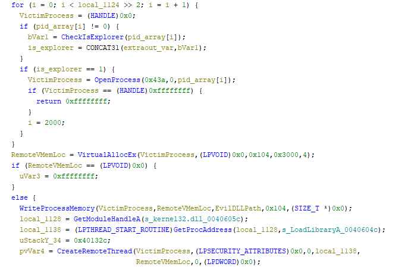
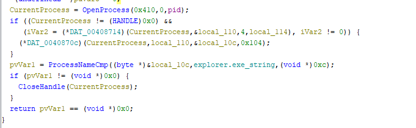
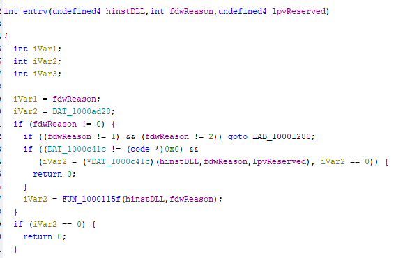
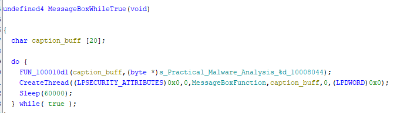
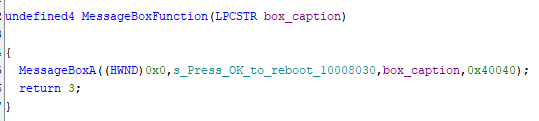
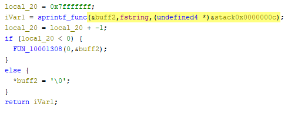

# Assignment 7

## 1. Loader's DLL Injection

The following block of code was found in the `Lab12.01.exe` file and this is where the DLL Injection happens. In the code block, we are able to see the program choosing a victim process to inject the DLL into (see next section for more detail on how), then after choosing, allocating memory for that process with the `VirtualAllocEx` function. Next, it writes to that memory with the function `WriteProcessMemory` and it chooses to write the variable `EvilDLLPath`, which is the string `<PROGRAM PATH>\Lab12-01.dll`. After writing this DLL to the process' memory, the program starts a new thread in that process with the `CreateRemoteThread` function -- targeting the same victim process and remote memory location. At this point, the malicious DLL in injected into the victim program and the start of the thread marks the execution of this injection.

## 2. Process Being Injected Into (Victim Process)
Seen in the code above, there is a function that loops through all the processes in the system and runs a function I labeled `CheckIsExplorer` on each PID. This function will check if that PID belongs to the Explorer application, and here is how I found this out. This is the meat of the `CheckIsExplorer` function:

This function attempts to open the PID passed to it with the `OpenProcess` function. It then executes another function I called `ProcessNameCmp` which takes in what seems to be some of that open process information and, most importantly, a string here labeled `explorer.exe_string`. This is a string defined as `"explorer.exe"`. After looking at this `ProcessNameCmp` function, it seems to return 0 if the string applies to the process, and some other number if the string does not apply to the process. The `CheckIsExplorer` function then will close the file handle if the result of the `ProcessNameCmp` is not 0, and return true if the comparison succeeds. This means that overall, the `CheckIsExplorer` function takes in the PID passed, opens the process, checks if the process has the executable of `"explorer.exe"`, and if so, returns true, otherwise the opened process is not Explorer and the function returns false.

## 3. DLL Entry Point
At this point, I opened up the DLL file in Ghidra and started looking through it. The only named function was `entry`, and so that is where I started. After investigating [these Microsoft Docs](https://learn.microsoft.com/en-us/windows/win32/dlls/dllmain) concerning the entry point of DLL main, DllMain takes in 3 parameters, which is also what this `entry` function takes in, and, more importantly, if we look at the logic outlined in the [doc's example](https://learn.microsoft.com/en-us/windows/win32/dlls/dllmain#example) concerning the behavior based on the input paramters and compare it to the code found in Ghidra, the code in Ghidra looks quite similar to the switch statement in the example:

Based on this, I went to the first function called after this switch-like statement, and investigated it more (I ended up calling the function `CreateCustomThreadFunc`). This function takes in the `fdwReason` parameter from `entry` and if it is equal to `DLL_PROCESS_ATTACH` (which is the corresponding reason from a thread started from a loader), the DLL creates a new thread with a new function called I called `MessageBoxWhileTrue` (investigated in the next section). Overall, because of the similar structure of the Microsoft Docs for DllMain, the fact that this function is called the `entry` function of the DLL, this function taking in all the right types of parameters, and finally because we see some meaningful functionality in this function, I believe this function is the DllMain of the DLL.

## 4. Malware Periodic Functionality
Within the `MesageBoxWhileTrue` function (which is created on a new thread during the call of DllMain), the program seems to create a new thread every `60000` milliseconds (or 60 seconds). This function can be seen here:

The `CreateThread` function creates a thread based with the routine `MessageBoxFunction`. The actual functionality of this thread is explored in the next section, but this function shows that the program will create a new thread based on this function every 60 seconds forever, as it is in the `while (true)` block.

Overall this function can be found in this hierarchy: `Lab12-01.dll > entry (a.k.a. DllMain) > CreateCustomThreadFunc > MessageBoxWhileTrue`.

## 5. Malware Functionality Every 60 Seconds
The main thing that this malware does is create a message box window on the user's system every minute. This is done through the `MessageBoxFunction`, which, as seen below, calls the Windows `MessageBoxA` function based on a passed content string and caption string. This windows function essentially causes a pop-up to happen with the given content/caption. The content is simply the string `"Press OK to reboot"`.

The caption is slightly more complicated. This `MessageBoxFunction` just receives the caption string as a function parameter, and it is genereated in the calling function, `MessageBoxWhileTrue`. What is certain is that the caption takes on the form of `"Practical Malware Analysis %d"`, where `%d` I believe is signifiying that this is some time of formatted string. So the pop-up will have a caption of `"Practical Malware Analysis X"`, where `X` is some integer.

Determining what this integer is was far more difficult, and I never truly understood what integer is populated in that spot. There is one function which has many, many subfunctions called within it, but I believe this to be an `sprintf`-type function. And the integer for this seems to be just a stack variable, as seen in the highlighted code below (from Ghidra):

.

So, although I do not know certainly what integer will be in the pop-up message caption, I know it will take the form above. Most importantly though, from the previous explanations I know that this malicious DLL creates a pop-up every 60 seconds with content telling the user `"Press OK to reboot"`.

