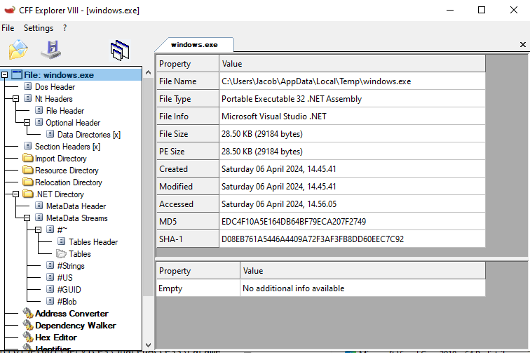

# Assignment 8

## OSINT

The malware we are looking at in this report is called `njRAT`, and is said to be a Remote Access Trojan. This malware is also called `Bladabindi` [1][3], and according to some sources [1][3][4], was first discovered in 2012, but according to other sources such as cynet.com[2], was first detected in 2013. This malware is largly been used by actors in the Middle East [3][4][5], and has reported been seen and used at recently as July 2023 by the "Computer Emergency Reponse Team of Ukraine" [3]. According to any.run [6], this malware was most popular and most frequently seen in 2014 in the Middle East. But, it is also refrenced as the 8th most widespread threads [1][7] even in 2023!  This malware is able to activate the remotely access the computer [3][5], webcam [1][2][3][5], log keystrokes [1][2][3][5], steal passwords from web browsers [1][2], upload/download files [1][2] and many other processes that remote access gives.

- [1] https://www.checkpoint.com/cyber-hub/threat-prevention/what-is-malware/what-is-njrat-malware/
- [2] https://www.cynet.com/attack-techniques-hands-on/njrat-report-bladabindi/
- [3] https://www.splunk.com/en_us/blog/security/more-than-just-a-rat-unveiling-njrat-s-mbr-wiping-capabilities.html
- [4] https://attack.mitre.org/software/S0385/
- [5] https://malpedia.caad.fkie.fraunhofer.de/details/win.njrat
- [6] https://any.run/malware-trends/njrat
- [7] https://gridinsoft.com/backdoor/njrat

## RegShot
### Added Keys
After running RegShot, I noticed various Regsitry Keys that were added that I found to be suspicious. Here are list of them with a bit of explanation of what they might be doing.

- `HKLM\SYSTEM\CurrentControlSet\Services\SharedAccess\Parameters\FirewallPolicy\FirewallRules\{E675A880-8829-4D38-8B13-2215124449B8}: "v2.30|Action=Allow|Active=TRUE|Dir=In|Protocol=6|Profile=Public|App=C:\Users\Jacob\AppData\Local\Temp\windows.exe|Name=windows.exe|"` This key seems to be creating a firewall rule that allows the incoming network traffic to the program `C:\Users\Jacob\AppData\Local\Temp\windows.exe`. Specifically, it seems to allow such traffic over TCP (`Protocol=6` means TCP) on the `Public` profile. Essentially, this key allows inbound TCP traffic to the specified program.

- `HKLM\SYSTEM\CurrentControlSet\Services\SharedAccess\Parameters\FirewallPolicy\FirewallRules\{CA9B1B63-FFDF-4422-AFBE-D9CB7E54FE62}: "v2.30|Action=Allow|Active=TRUE|Dir=In|Protocol=17|Profile=Public|App=C:\Users\Jacob\AppData\Local\Temp\windows.exe|Name=windows.exe|"` This key is exactly the same as the prior key, except that it now has a `Protocol=17`, which means this key allows inbound network traffic to the same `windows.exe` program, but this time for UDP.

- `HKU\S-1-5-21-4259431065-18183230-4223108981-1001\SOFTWARE\Microsoft\Windows\CurrentVersion\Run\ecc7c8c51c0850c1ec247c7fd3602f20: ""C:\Users\Jacob\AppData\Local\Temp\windows.exe" .."` This key seems to creating a setting that makes the same `windows.exe` program to run whenever the user `S-1-5-21-4259431065-18183230-4223108981-1001` (in our case, this is 'Jacob') logs in. This is because any keys under the `\SOFTWARE\Microsoft\Windows\CurrentVersion\Run\` path specifiy programs that autorun on user login.

- `HKU\S-1-5-21-4259431065-18183230-4223108981-1001\Environment\SEE_MASK_NOZONECHECKS: "1"` This key seems cause the "Zone Check" to be disabled for the user. Zone Checks are essentially security checks where Windows attempts to determine the origin of the file, and will warn the user if the origin cannot be identified. Therefore, this key will disable some security checks, and therefore warnings, for programs run by the user.

- `HKU\S-1-5-21-4259431065-18183230-4223108981-1001\SOFTWARE\Microsoft\Windows\CurrentVersion\Explorer\UserAssist\{CEBFF5CD-ACE2-4F4F-9178-9926F41749EA}\Count\P:\Gbbyf\Ertfubg-k64-Havpbqr\Ertfubg-k64-Havpbqr.rkr`. I'm not really sure what these keys are or what they do. The reason I put them here is because they are heavily modified (in the next section) while the malware is running, and the strings are quite strange and suspicious. There a few of these keys created with the same stem under `\User\Assist\{ID}\`, but with different paths coming after it.

### Modified Keys

The only suspicious keys that I was able to see in the modified keys section were these types of modifications:

- `HKU\S-1-5-21-4259431065-18183230-4223108981-1001\SOFTWARE\Microsoft\Windows\CurrentVersion\Explorer\UserAssist\{CEBFF5CD-ACE2-4F4F-9178-9926F41749EA}\Count\Zvpebfbsg.Jvaqbjf.Rkcybere: 00 00 00 00 06 00 00 00 06 00 00 00 A2 08 02 00 00 00 80 BF 00 00 80 BF 00 00 80 BF 00 00 80 BF 00 00 80 BF 00 00 80 BF 00 00 80 BF 00 00 80 BF 00 00 80 BF 00 00 80 BF FF FF FF FF 90 B2 3C CE 70 88 DA 01 00 00 00 00`

- `HKU\S-1-5-21-4259431065-18183230-4223108981-1001\SOFTWARE\Microsoft\Windows\CurrentVersion\Explorer\UserAssist\{CEBFF5CD-ACE2-4F4F-9178-9926F41749EA}\Count\P:\Gbbyf\Ertfubg-k64-Havpbqr\Ertfubg-k64-Havpbqr.rkr: 00 00 00 00 04 00 00 00 06 00 00 00 A2 7F 03 00 00 00 80 BF 00 00 80 BF 00 00 80 BF 00 00 80 BF 00 00 80 BF 00 00 80 BF 00 00 80 BF 00 00 80 BF 00 00 80 BF 00 00 80 BF FF FF FF FF 30 EB A7 F7 71 88 DA 01 00 00 00 00`

I am still unsure as to what these do, but in the modified section there is quite a bit of data being set in these odd strings. Perhaps this is some sort of payload left behind and executed by the program on a schedule, but I'm not sure.

### Indicators of Compromise from Registry
Overall, the existance of firewall rules existing in the registry for the program `C:\Users\<USER>\AppData\Local\Temp\windows.exe` is one of the better indicators of compromise from this malware from the Registry. Also, the creation of the keys associated with running this program whenever the user logs on. The registry key setting `SEE_MAK_NOZONECHECKS` to `"1"` could also be an indicator, but not as specific to this malware.

### Added Files
I noticed that these files were created when the malware was run:
- `C:\Users\Jacob\AppData\Local\Temp\windows.exe`
- `C:\njq8.exe`
- `C:\Users\Jacob\AppData\Roaming\Microsoft\Windows\Start Menu\Programs\Startup\ecc7c8c51c0850c1ec247c7fd3602f20.exe`

All of these files were created at the time the malware was created. These files seem to all share the same MD5 hash: `EDC4F10A5E164DB64BF79ECA207F2749`. As seen here:

I searched this hash on VirusTotal and was met with many detections saying this file was a `trojan.bladabindi` As mentioned in the introduction, this `Bladabindi` is another name used for 'njRAT'. According to [this official Microsoft documentation](https://www.microsoft.com/en-us/wdsi/threats/threat-search?query=Backdoor:Win32/Bladabindi), this program "gives backdoor access to your PC" and "bypasses the Windows Firewall in your computer to connect to a remote server". This bypassing of the firewall is exactly what we saw in the registry keys as well.

### Indicators of Compromise from Filesystem
Overall, the exitance of that `windows.exe` file under and user's `AppData\Local\Temp\` directory is a good indiciator of compromise. Likewise, seeing that startup program (`ecc7c8c51c0850c1ec247c7fd3602f20.exe`) for the user is another good indicator from the filesystem. Finally, the existance of the `C:\njq8.exe` file is a really easy indicator of compromise, as this is a global directory, not specific to a user and is the same malicious file found in the other places (known through the hash being the same).

## FakeNet
After starting FakeNet and running the malware, there was really only one network action that I found to be suspicious and an indicator of compromise. Every ~25 seconds, my infected computer would send a DNS request for the domain `zaaptoo.zapto.org`. This can be seen in the following screenshot of FakeNet:

The domain name `zapto.org` seems to be a legtimate service, namely, a free Dynamic DNS service. This type of service allows users to have a domain name that can point to their computer(s) even when that IP changes, as the Dynamic DNS service tracks the change in IP and knows to point DNS requests to the new IPs. So it seems that the creator of the malware obtained a subdomain from this legitimate service, namely, the `zaaptoo` subdomain. Currently, sending a DNS request for the `zaaptoo.zapto.org` domain returns no results, which implies this subdomain as been shutdown.

### Indicators of Compromise from Network
A simple, yet effective, indicator of compromise, from the network are any DNS requests for the `zaaptoo.zapto.org` domain. If a machine is making such requests, especially in a periodic fashion, this is a good indicator of compromise from this njRAT malware.